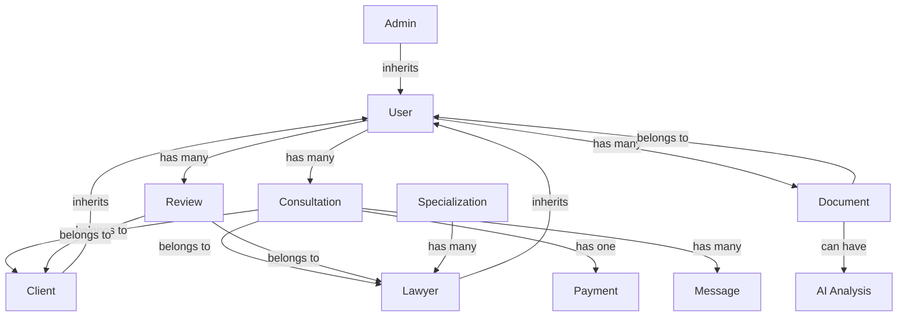

# Архитектура МаслаХат - Модульная Система

## 📋 Общая Структура

```
frontend/src/
├── modules/               # Изолированные бизнес-модули
│   ├── auth/             # Аутентификация
│   ├── users/            # Управление пользователями
│   ├── consultations/    # Консультации
│   ├── lawyers/          # Юристы
│   ├── documents/        # Документы
│   └── ai/               # AI функционал
├── shared/               # Общие компоненты
│   ├── components/       # UI компоненты
│   ├── hooks/           # React hooks
│   ├── utils/           # Утилиты
│   └── validators/      # Валидаторы
└── core/                # Ядро системы
    ├── api/             # API клиент
    ├── store/           # Redux store
    └── types/           # TypeScript типы
```

## 🔗 Связи Между Модулями

### Модель данных и зависимости



## 📦 Модули

### 1. Auth Module (Независимый)
**Зависимости:** Нет
**Используется:** Всеми модулями
**Конфликты:** Низкий риск

```javascript
// modules/auth/
├── types.ts          // User, AuthState, LoginCredentials
├── services.ts       // login, logout, register
├── hooks.ts          // useAuth, useUser
├── store.ts          // authSlice
└── validators.ts     // validateEmail, validatePassword
```

### 2. Users Module
**Зависимости:** auth
**Используется:** consultations, lawyers, documents
**Конфликты:** Средний риск

```javascript
// modules/users/
├── types.ts          // UserProfile, UserRole
├── services.ts       // getUser, updateUser
├── hooks.ts          // useUser, useUserProfile
├── store.ts          // usersSlice
└── validators.ts     // validateProfile
```

### 3. Consultations Module
**Зависимости:** auth, users, lawyers
**Используется:** dashboard, notifications
**Конфликты:** Высокий риск (критичный модуль)

```javascript
// modules/consultations/
├── types.ts          // Consultation, ConsultationRequest
├── services.ts       // bookConsultation, getConsultations
├── hooks.ts          // useConsultations, useBooking
├── store.ts          // consultationsSlice
├── validators.ts     // validateBooking, checkAvailability
└── conflict-detector.ts  // detectDuplicates, checkTimeConflict
```

### 4. Lawyers Module
**Зависимости:** auth, users
**Используется:** consultations, reviews
**Конфликты:** Средний риск

```javascript
// modules/lawyers/
├── types.ts          // Lawyer, Specialization, Schedule
├── services.ts       // searchLawyers, getLawyer
├── hooks.ts          // useLawyers, useLawyerProfile
├── store.ts          // lawyersSlice
└── validators.ts     // validateLicense, validateSchedule
```

### 5. Documents Module
**Зависимости:** auth, users
**Используется:** consultations, ai
**Конфликты:** Низкий риск

```javascript
// modules/documents/
├── types.ts          // Document, DocumentType
├── services.ts       // uploadDocument, getDocuments
├── hooks.ts          // useDocuments, useUpload
├── store.ts          // documentsSlice
└── validators.ts     // validateFile, checkDuplicate
```

### 6. AI Module
**Зависимости:** auth, documents
**Используется:** consultations, documents
**Конфликты:** Низкий риск

```javascript
// modules/ai/
├── types.ts          // AIResponse, AIQuery
├── services.ts       // askAI, analyzeDocument
├── hooks.ts          // useAI, useDocumentAnalysis
└── store.ts          // aiSlice
```

## 🛡️ Система Предотвращения Конфликтов

### Уровни Защиты

#### 1. Валидация на уровне модуля
```typescript
// Каждый модуль имеет свои валидаторы
export const consultationValidators = {
  checkDuplicate: (request: ConsultationRequest) => boolean,
  checkTimeConflict: (lawyerId, date, time) => boolean,
  validateRequest: (request: ConsultationRequest) => ValidationResult
}
```

#### 2. Детектор конфликтов
```typescript
// shared/validators/conflict-detector.ts
export const ConflictDetector = {
  // Проверка дубликатов
  detectDuplicateConsultation: (newRequest, existing) => Conflict | null,

  // Проверка пересечений времени
  detectTimeConflict: (schedule, newSlot) => Conflict | null,

  // Проверка уникальности
  detectUniqueViolation: (entity, field, value) => Conflict | null
}
```

#### 3. Транзакционность операций
```typescript
// core/store/transaction.ts
export const withTransaction = async (operation, rollbackFn) => {
  const snapshot = createSnapshot();
  try {
    await operation();
  } catch (error) {
    await rollbackFn(snapshot);
    throw error;
  }
}
```

## 🔄 Правила Изменений

### Безопасное изменение модуля

1. **Изменения только внутри модуля**
   - Меняйте только файлы внутри папки модуля
   - Не меняйте типы, используемые другими модулями

2. **Экспорт через index.ts**
   ```typescript
   // modules/consultations/index.ts
   export * from './types';
   export * from './services';
   export * from './hooks';
   ```

3. **Версионирование API**
   ```typescript
   // v1/consultations.ts
   export const consultationServiceV1 = { ... }

   // v2/consultations.ts
   export const consultationServiceV2 = { ... }
   ```

4. **Тестирование зависимостей**
   ```bash
   npm run test:module consultations
   npm run test:dependencies consultations
   ```

## 📊 Матрица Зависимостей

| Модуль | Auth | Users | Consultations | Lawyers | Documents | AI |
|--------|------|-------|---------------|---------|-----------|-----|
| Auth | - | ❌ | ❌ | ❌ | ❌ | ❌ |
| Users | ✅ | - | ❌ | ❌ | ❌ | ❌ |
| Consultations | ✅ | ✅ | - | ✅ | ❌ | ❌ |
| Lawyers | ✅ | ✅ | ❌ | - | ❌ | ❌ |
| Documents | ✅ | ✅ | ❌ | ❌ | - | ❌ |
| AI | ✅ | ❌ | ❌ | ❌ | ✅ | - |

✅ = Разрешенная зависимость
❌ = Запрещенная зависимость

## 🚨 Система Предупреждений

### Pre-commit Hook
```javascript
// .husky/pre-commit
- Проверка циклических зависимостей
- Проверка нарушения матрицы зависимостей
- Линтинг изменённых модулей
- Запуск тестов затронутых модулей
```

### Runtime Checks
```typescript
if (process.env.NODE_ENV === 'development') {
  // Проверка попыток создания дубликатов
  detectDuplicates();

  // Проверка конфликтов
  detectConflicts();

  // Логирование межмодульных вызовов
  logModuleInteractions();
}
```

## 📝 Примеры Использования

### Безопасное создание консультации
```typescript
import { useConsultations } from '@/modules/consultations';
import { ConflictDetector } from '@/shared/validators';

const { bookConsultation } = useConsultations();

const handleBook = async (data) => {
  // 1. Проверка дубликатов
  const duplicate = await ConflictDetector.detectDuplicateConsultation(data);
  if (duplicate) {
    toast.error('Такая консультация уже существует');
    return;
  }

  // 2. Проверка временных конфликтов
  const timeConflict = await ConflictDetector.detectTimeConflict(data);
  if (timeConflict) {
    toast.error('Юрист занят в это время');
    return;
  }

  // 3. Безопасное создание
  await bookConsultation(data);
}
```

## 🔧 Инструменты Разработки

### CLI команды
```bash
# Создать новый модуль
npm run module:create <name>

# Проверить зависимости
npm run module:check-deps

# Анализ конфликтов
npm run module:analyze

# Визуализация связей
npm run module:visualize
```

### Автогенерация
```bash
# Сгенерировать типы из схемы
npm run generate:types

# Обновить матрицу зависимостей
npm run generate:deps-matrix
```

## 📈 Метрики

### Качество модульности
- **Связанность**: < 3 зависимости на модуль
- **Сцепление**: Высокое внутри модуля, низкое между модулями
- **Цикломатическая сложность**: < 10

### Отслеживание
```typescript
// DevTools показывает
- Граф зависимостей
- Активные модули
- Потенциальные конфликты
- Производительность модулей
```
